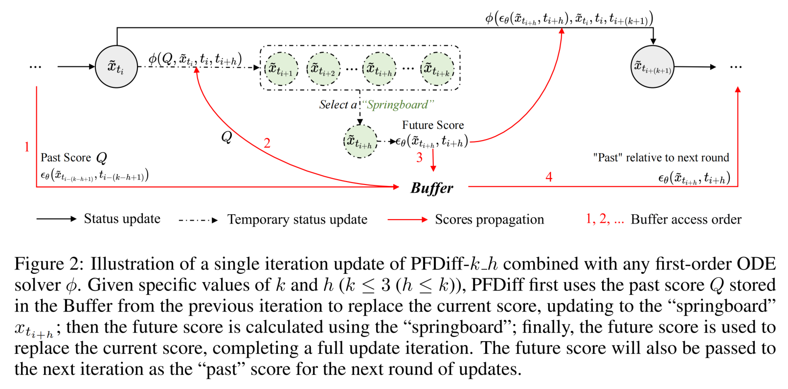
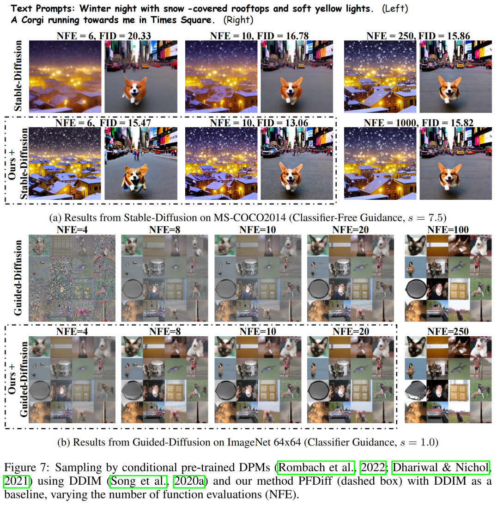

# PFDiff: Training-Free Acceleration of Diffusion Models Combining Past and Future Scores<br><sub>Official PyTorch implementation of the [ICLR 2025](https://openreview.net/forum?id=wmmDvZGFK7) paper</sub>

🔗 **Links**  
- 📄 **ArXiv**: [arxiv.org/abs/2408.08822](https://arxiv.org/abs/2408.08822)  
- 📝 **OpenReview**: [openreview.net/forum?id=wmmDvZGFK7](https://openreview.net/forum?id=wmmDvZGFK7)
- 🖼️ **Poster**: [View Poster (PNG)](https://iclr.cc/media/PosterPDFs/ICLR%202025/27822.png?t=1743947768.3811555)

📧 **Contact**: [wangguangyi@stu.xmu.edu.cn](mailto:wangguangyi@stu.xmu.edu.cn)

# Introduction
PFDiff is a *training‐free*, orthogonal timestep-skipping method that accelerates diffusion model sampling. It uses past scores to predict a "springboard" and applies Nesterov-inspired foresight updates to correct discretization errors, thereby reducing the number of function evaluations (NFE). For example, with DDIM it achieves 16.46 FID in 4 NFE on ImageNet 64x64 and 13.06 FID in 10 NFE on Stable Diffusion. 


# Usage
Our code is divided into two parts: conditional sampling and unconditional sampling, each providing two examples. Please configure your environment according to the tutorial below. Since our code is based on the implementation of the code from the cited paper, if you encounter any unforeseen issues, please refer to the corresponding tutorial in the codebase. We use [pytorch_fid](https://github.com/mseitzer/pytorch-fid) to get the FID. Thank you for using our code!

## Conditional Sampler
Our code is based on modifications of the [Stable Diffusion](https://github.com/CompVis/stable-diffusion) and [Guided Diffusion](https://github.com/openai/guided-diffusion). If you encounter any unforeseen issues, please refer to the code of that paper.

### Environment
Please open the `README.md` file in the Stable Diffusion folder and configure the `ldm` virtual environment according to the instructions provided in the file. Note! This environment is applicable to both Stable Diffusion and Guided Diffusion!

### Resources
- Stable Diffusion: Please download the `sd-v1-4.ckpt` checkpoint according to the `README.md` file and place it in the `models` folder. This `README.md` document also provides the `.npz` file required for calculating the FID score; please read it carefully. Additionally, download the CLIP model from [this Kaggle link](https://www.kaggle.com/datasets/ferruccioliu/openai-clip-vit-large-patch14?resource=download) and place it in the `openai` folder. *Additionally*, you need to download the COCO2014 validation dataset and place it in the `./data/data/coco/2014` directory. This path can be modified in the configuration file. The download method is mentioned in the `README.md` document in the Stable Diffusion folder.

- Guided Diffusion: Please open the `README.md` file in the guided_diffusion folder, and follow the instructions within to download the model into the `models` folder, and the `.npz` file for calculating FID into the `fid_stats` folder.

### Run the Code
- Stable Diffusion: It's essential to set both n_samples in these scripts and batch_size in configs/stable-diffusion/v1-inference_coco.yaml to desired your batch size. We use `sample_fid_ddim_s1.5.sh` and `sample_fid_ddim.sh` to run the code. The only difference between these two files is the guided scale. Use the command `bash sample_fid_ddim_s1.5.sh` to execute it. Both scripts are capable of running all the methods mentioned in the paper.

- Guided Diffusion: We use `sample_imagenet64_classifier_guidance.sh` to run the code. All methods mentioned in the paper can be executed using this file. Please set the `ALGORITHMS` parameter in the file, which allows the sequential execution of multiple algorithms. **Attention!!!** You need to set the `PYTHONPATH` in the file to your root directory `/condition/guided_diffusion`. This path is an absolute path.

## Unconditional Sampler
### Environment
Our code is based on modifications of the [DDIM](https://github.com/ermongroup/ddim) and [dpm-solver](https://github.com/LuChengTHU/dpm-solver) code. Please refer to the respective repository instructions for environment configuration. If you encounter any unexpected issues, please refer to the original papers.

### Resources
- ddim-main: Please install the packages listed in `requirements.txt`. Then, download the corresponding models from this link [HeiBOX](https://heibox.uni-heidelberg.de/d/01207c3f6b8441779abf/?p=%2F&mode=list) into the `diffusion_models_converted` folder.

- dpm-solver: Please configure the environment and download the models according to the `README.md` document in the dpm-solver folder. It is advisable to ensure that your CUDA version is up-to-date before running the code. If you encounter any issues, consider downgrading the PyTorch version to 1.8.

### Run the Code
- ddim-main: We use `run_cifar.sh` to run the CIFAR10 dataset, `run_church.sh` to run lsun_church, `run_bedroom.sh` to run lsun_bedroom, and `run_celebA.sh` to execute CelebA. You can modify the `SKIP_TYPE` to change the time steps.

- dpm-solver: We use `sample.sh` to run the code. If you want to run dpm++, please modify the `sampling.algorithm_type` in the file `dpm-solver/examples/score_sde_pytorch/configs/vp/cifar10_ddpmpp_deep_continuous.py` to `'dpmsolver++'`.
All algorithms can be run by modifying the `algorithms` parameter in the file.

# Results


# Acknowledgements
This repo relies on the following existing codebases:
- [Stable Diffusion](https://github.com/CompVis/stable-diffusion) ([High-Resolution Image Synthesis with Latent Diffusion Models](https://arxiv.org/abs/2112.10752))
- [Guided Diffusion](https://github.com/openai/guided-diffusion) ([Diffusion Models Beat GANs on Image Synthesis](https://arxiv.org/abs/2105.05233))
- [DDIM](https://github.com/ermongroup/ddim) ([Denoising Diffusion Implicit Models](https://arxiv.org/abs/2010.02502))
- [dpm-solver](https://github.com/LuChengTHU/dpm-solver) ([DPM-Solver: A Fast ODE Solver for Diffusion Probabilistic Model Sampling in Around 10 Steps](https://arxiv.org/abs/2206.00927))

# Citation
If you find the code useful for your research, please consider citing:

```bibtex
@inproceedings{wang2025pfdiff,
  title={{PFD}iff: Training-Free Acceleration of Diffusion Models Combining Past and Future Scores},
  author={Guangyi Wang and Yuren Cai and lijiang Li and Wei Peng and Song-Zhi Su},
  booktitle={The Thirteenth International Conference on Learning Representations},
  year={2025},
  url={https://openreview.net/forum?id=wmmDvZGFK7}
}
