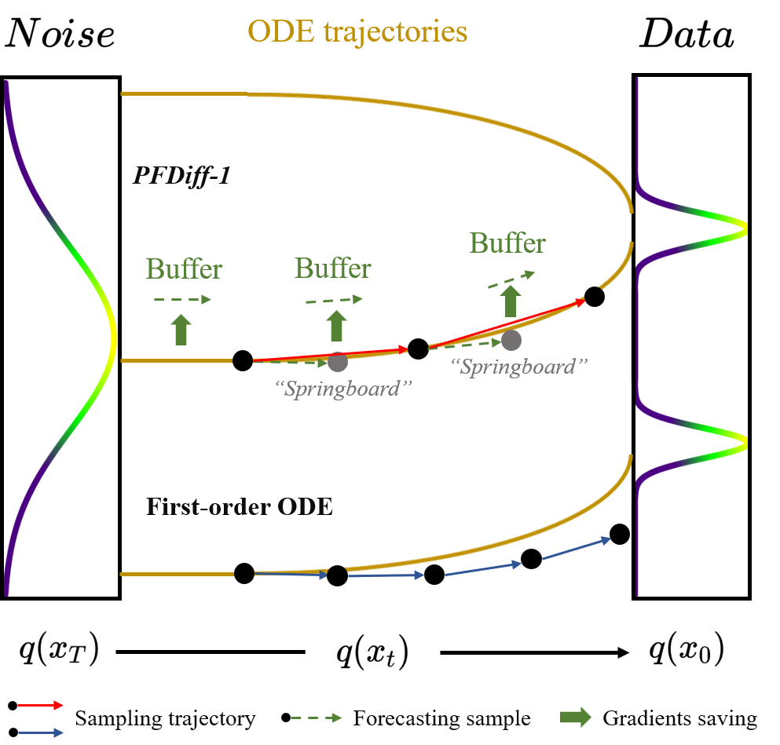

# PFDiff: Training-Free Acceleration of Diffusion Models Combining Past and Future Scores
This repository is the official code for the paper [PFDiff: Training-Free Acceleration of Diffusion Models Combining Past and Future Scores](https://openreview.net/forum?id=wmmDvZGFK7) (ICLR 2025).
[https://arxiv.org/abs/2408.08822](https://arxiv.org/abs/2408.08822)



Comparison of partial sampling trajectories between PFDiff-1 and a first-order ODE solver, where the update directions are guided by the tangent direction of the sampling trajectories.


Illustration of a single iteration update of PFDiff combined with any first-order ODE solver.

# Replication of Results

Our code is divided into two parts: conditional sampling and unconditional sampling, each providing two examples. Please configure your environment according to the tutorial below. Since our code is based on the implementation of the code from the cited paper, if you encounter any unforeseen issues, please refer to the corresponding tutorial in the original paper. We use *pytorch_fid* to get the FID.Thank you for using our code!

## Conditional Sampler
Our code is based on modifications of the [Stable Diffusion](https://github.com/CompVis/stable-diffusion) and [guided_diffusion](https://github.com/openai/guided-diffusion). If you encounter any unforeseen issues, please refer to the code of that paper.

### Envirment Setting
Please open the `README.md` file in the Stable Diffusion folder and configure the `ldm` virtual environment according to the instructions provided in the file. Note! This environment is applicable to both Stable Diffusion and guided_diffusion!

#### Stable Diffusion
Please download the `sd-v1-4.ckpt` checkpoint according to the `README.md` file and place it in the `models` folder. This `README.md` document also provides the `.npz` file required for calculating the FID score; please read it carefully. Additionally, download the CLIP model from [this Kaggle link](https://www.kaggle.com/datasets/ferruccioliu/openai-clip-vit-large-patch14?resource=download) and place it in the `openai` folder.

Additionally, you need to download the COCO2014 validation dataset and place it in the `./data/data/coco/2014` directory. This path can be modified in the configuration file. The download method is mentioned in the `README.md` document in the Stable Diffusion folder.


#### guided_diffusion
Please open the `README.md` file in the guided_diffusion folder, and follow the instructions within to download the model into the `models` folder, and the `.npz` file for calculating FID into the `fid_stats` folder.


### Run the Code

#### Stable Diffusion
It's essential to set both n_samples in these scripts and batch_size in configs/stable-diffusion/v1-inference_coco.yaml to desired your batch size.
We use `sample_fid_ddim_s1.5.sh` and `sample_fid_ddim.sh` to run the code. The only difference between these two files is the guided scale. Use the command `cat sample_fid_ddim_s1.5.sh | bash` to execute it. Both scripts are capable of running all the methods mentioned in the paper.

### guided_diffusion
We use `sample_imagenet64_classifier_guidance.sh` to run the code. All methods mentioned in the paper can be executed using this file. Please set the `ALGORITHMS` parameter in the file, which allows the sequential execution of multiple algorithms.
**Attention!!!** You need to set the `PYTHONPATH` in the file to your root directory `/condition/guided_diffusion`. This path is an absolute path, and you can use `xftp` to view it.

## Unconditional Sampler

### Envirment Setting

Our code is based on modifications of the [DDIM](https://github.com/ermongroup/ddim) and [dpm-solver](https://github.com/LuChengTHU/dpm-solver) code. If you encounter any unexpected issues, please refer to the original papers.

#### ddim-main

Please install the packages listed in `requirements.txt`. Then, download the corresponding models from this link [HeiBOX](https://heibox.uni-heidelberg.de/d/01207c3f6b8441779abf/?p=%2F&mode=list) into the `diffusion_models_converted` folder.

#### dpm-solver

Please configure the environment and download the models according to the `README.md` document in the dpm-solver folder. It is advisable to ensure that your CUDA version is up-to-date before running the code. If you encounter any issues, consider downgrading the pyTorch version to 1.8.

### Run the Code

#### ddim-main
We use `run_cifar.sh` to run the cifar10 dataset, `run_church.sh` to run lsun_church, `run_bedroom.sh` to run lsun_bedroom, and `run_celebA.sh` to execute celebA. You can modify the `SKIP_TYPE` to change the time steps.


#### dpm-solver

We use `sample.sh` to run the code. If you want to run dpm++, please modify the `sampling.algorithm_type` in the file `dpm-solver/examples/score_sde_pytorch/configs/vp/cifar10_ddpmpp_deep_continuous.py` to `'dpmsolver++'`.
All algorithms can be run by modifying the `allalgorithms` parameter in the file.

# Citation

If you use this code for your research, please consider citing the paper:

```bibtex
@article{wang2024pfdiff,
  title={PFDiff: Training-Free Acceleration of Diffusion Models Combining Past and Future Scores},
  author={Wang, Guangyi and Cai, Yuren and Li, Lijiang and Peng, Wei and Su, Songzhi},
  journal={arXiv preprint arXiv:2408.08822},
  year={2024}
}